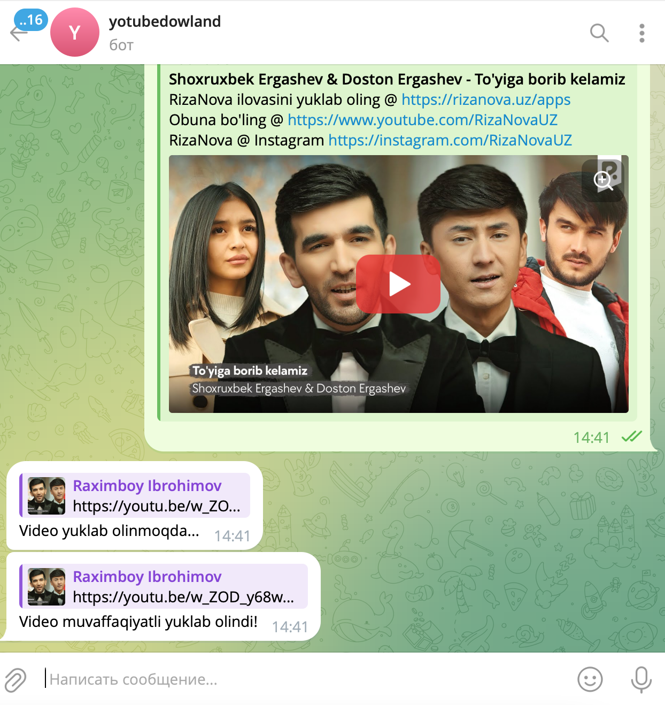

<div align="center">

# 📥 YouTube Downloader Bot

**A Telegram bot that downloads YouTube video and audio straight into the chat**

<p>
  
  
  
</p>

<p>
  <a href="https://github.com/Raximboy7/yotubedowlandsbot/stargazers"></a>
  <a href="https://github.com/Raximboy7/yotubedowlandsbot/commits"></a>
  <a href="https://github.com/Raximboy7/yotubedowlandsbot/blob/main/LICENSE"></a>
</p>

</div>

<p align="center">
  
</p>

---


## 📖 Overview

Send the bot a YouTube link and pick a format — it fetches the media with `yt-dlp`, converts it if needed and uploads the file back to Telegram. Built with `pyTelegramBotAPI`, it runs on a single process and needs nothing but a bot token.


## ✨ Features

- 🎬 **Video download** — MP4 in the best available quality
- 🎵 **Audio extraction** — MP3 for music and podcasts
- 🔗 **Link detection** — paste a URL, the bot does the rest
- ⚡ **Inline keyboards** for choosing the format
- 🧹 **Automatic cleanup** of temporary files after upload
- 🔐 **Token from environment** — no secret ever touches the repository


## 🚀 Getting Started

```bash
# 1 — clone
git clone https://github.com/Raximboy7/yotubedowlandsbot.git
cd yotubedowlandsbot

# 2 — virtual environment
python -m venv venv
source venv/bin/activate          # Windows: venv\Scripts\activate

# 3 — dependencies
pip install -r requirements.txt

# 4 — environment variables
cp .env.example .env              # add your token

# run
python main.py
```


## 🔧 Configuration

Copy `.env.example` to `.env` and fill in your own values. **`.env` is git-ignored — never commit it.**

| Variable | Description | Default |
|---|---|---|
| `BOT_TOKEN` | Telegram bot token from @BotFather | — |


## 📁 Project Structure

```
yotubedowlandsbot/
├── main.py            # bot entry point, handlers
├── requirements.txt
├── .env.example
├── bot.png            # preview image
└── .gitignore
```


## 🗓 Roadmap

- [ ] Playlist support
- [ ] Progress bar while downloading
- [ ] Split files larger than Telegram's 50 MB upload limit
- [ ] Instagram / TikTok links
- [ ] Docker image + systemd unit


---

<details>
<summary><b>🇺🇿 &nbsp;O'zbekcha tavsif</b></summary>

<br/>

## 📖 Loyiha haqida

Botga YouTube havolasini yuborasiz, formatni tanlaysiz — bot `yt-dlp` orqali yuklab olib, faylni Telegramga qaytaradi. `pyTelegramBotAPI` asosida yozilgan, ishlashi uchun faqat bot tokeni kerak.

## 🚀 Ishga tushirish

```bash
# 1 — clone
git clone https://github.com/Raximboy7/yotubedowlandsbot.git
cd yotubedowlandsbot

# 2 — virtual environment
python -m venv venv
source venv/bin/activate          # Windows: venv\Scripts\activate

# 3 — dependencies
pip install -r requirements.txt

# 4 — environment variables
cp .env.example .env              # add your token

# run
python main.py
```

</details>

---

## 🤝 Contributing

Issue va Pull Request'lar ochiq. Katta o'zgarishdan oldin issue orqali muhokama qiling.

## 📄 License

MIT — batafsil [`LICENSE`](LICENSE) faylida.

## 👤 Author

<table>
<tr>
<td align="center">
<a href="https://github.com/Raximboy7"></a>
</td>
<td>

**Raximboy Ibrohimov**<br/>
Backend &amp; Mobile Developer · Tashkent, Uzbekistan 🇺🇿

[](https://ibrohimov-dev.uz)
[](https://www.linkedin.com/in/raximboy-ibroximov-a75855268/)
[](https://t.me/Raximboy7)
[](mailto:raximboy4200@gmail.com)

</td>
</tr>
</table>

<div align="center">
<sub>⭐ Foydali bo'lsa, yulduzcha qoldiring!</sub>
</div>
